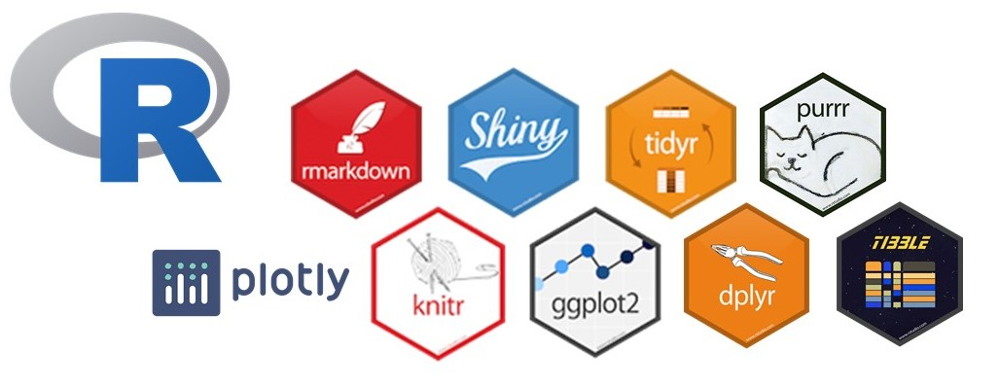

## Description

This project is aimed at providing visualizations of animations. An application to explore the various number of Anime(Japan Animation) with different genres and ratings out of 10. Rating scores given by users to the animes that they has watched completely. With the help of this project everyone can choose which one to watch by putting different filters, by production, genre, premiered year and etc. 

## This dashboard has 2 pages

****Summary**** --> general information about animations, this page contains 3 KPI boxes, one Table filtered by Year and one Pie-Plot with filter by various Genres

**Detail --->** detail informations with different filters, this page includes Median Score Plot(ggplot) and Data Overview of episodes and duration per episode in minutes of each animation

## Data source: 
The whole dataset from https://www.kaggle.com/hernan4444/anime-recommendation-database-2020. This dataset contains information about 2.800 anime and the preference from 325.772 different users

## Packages used
 

